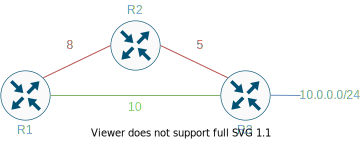
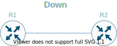
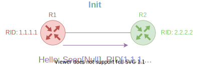
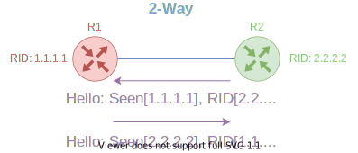

# OSPF
## What is OSPF?
- Open Shortest Path First
- IGP
- Non-proprietary
- No hop count limit
- Supports Variable Length Subnet Masks (VLSM)
- Link state protocol
- Supports authentication
## What are link states?
- Link is an interface on a router
- Link state is a description e.g.
    - IP address
    - Mask
    - Type of network it's connected to
- Collection of link states maker a Link State Database (LSDB)
## What is the Shortest Path First Algorithm?
- Uses Dijkstras algorithm
1. A router generates a Link State Advertisement (LSA) which contains all Link States in the LSDB.
2. All routers exchange LSAs by flooding and add any unknown entries to their LSDB. This continues until all LSDBs are identical.
3. Routers calculate the Shortest Path Tree to all destinations. The destinations, associated cost and next hop all form the routing table.
4. Any network change is communicated through Link State packets and step 3  is repeated.
## OSPF Cost
- Cost is the routing metric
- Cost is inversely proportional to the interface bandwidth:

        cost = 100,000,000/bandwidth in bps

## Shortest Path Tree
- The Shortest Path is calculated by summing the costs to the destination, e.g. calculate the shortest path for R1 to the 10.0.0.0/24 network: 

- Red path is a cost of 13 whereas green path is a cost of 10
- Green path would be the Shortest Path as the cost to the destination network is lowest

## Areas and Border Routers
- Areas put a boundary on where LSAs are flooded
- All routers in an area have identical LSDBs
- There are 3 types of router in OSPF:
    - **Internal Router (IR):** All interfaces are in the same area 
    - **Area Border Router (ABR):** Routers that that have interfaces in multiple areas
    - **Autonomous System Boundary Router (ASBR):** Routers that acts as gateways (redistribution) between OSPF and other routing protocols (e.g. EIGRP, BGP, RIP...)

## Area 0
- Backbone area
- If multiple areas are configures, one must be area 0
- All other areas must connect to area 0, if this is not possible a virtual link must be used

## Link State Types
- **Router Links:** State and cost of interfaces within the same area (intra-area).
- **Summary Links:** Originated by ABRs only. Describe networks in the same AS but outside the are (inter-area).
- **Network Links:** Originated by Designated Routers (DRs) only. For multi-access segments with 1 or more attached router. Describe all routers attached to a specific segment.
- **External Links:** Originated by ASBR. Describe destinations outside the AS.

## Enabling OSPF
<pre>
(config)# <b>router ospf</b> process-id
</pre>
<pre>
(config-router)# <b>network</b> ip-address wildcard-mask area-id
</pre>

## OSPF Authentication
- Off by default
- 2 methods:
    - Simple password authentication
    - MD-5

## OSPF Neighbors
- Neighbors are elected via the Hello protocol
- Hello packets are sent out periodically to the multicast address
- Routers become neighbors as soon as they see themselves listed in the neighbor's Hello packet
- To become neighbors the following must be identical:
    - **Area-ID**
    - **Authentication**
    - **Hello Interval:** Default is 10 sec.
    - **Dead Interval:** Default is 4 times the Hello interval making it 40 sec.
    - **Stub Area Flag**
    - *MTU Size:* Not technically compulsory but will cause the routers to be stuck in the Exstart/Exchange stage.

## Configuring Hello and Dead Intervals
- Interface level commands:
<pre>
(config)# <b>ip ospf hello-interval</b> seconds
</pre>
<pre>
(config)# <b>ip ospf dead-interval</b> seconds
</pre>

## OSPF Adjacencies
- Next step after neighboring
- Adjacent routers process into the database exchange process
- Designated Router (DR) and Backup Designated Router (BDR) are elected on each multi-access segment
-  Instead of each router exchanging updates with every other router on the segment, every router exchanges information with the DR and BDR.

### DR and BDR Election
- Done via the Hello protocol
- The router with the **highest OSPF priority** on a segment will become the DR for that segment.
- The same process is repeated for the BDR.
- In case of a tie, the router with the **highest RID** will win.
- The default for the interface OSPF priority is one.

### OSPF Priority Configuration
- Interface level command:
<pre>
(config-if)# <b>ip ospf priority</b> value
</pre>

## OSPF Neighbor States:
1. **Down:** No hello packets received.

2. **Attempt:** For manually configured neighbors on non-broadcast multi-access (NBMA) networks such as Frame Relay and X.25, this state indicates that no recent information has been received from the neighbor. An effort should be made to contact the neighbor by sending Hello packets at the reduced rate PollInterval.

3. **Init:**  R2 has detected a Hello packet coming from a R1 but the R2 RID was not included in the Hello packet signifying that R1 hasn't received a Hello packet from R2.

4. **2-Way:** There is bi-directional communication with a neighbor. The router has seen itself in the Hello packets coming from a neighbor. At the end of this stage the DR and BDR election would have been done. At the end of the 2way stage, routers will decide whether to proceed in building an adjacency or not. The decision is based on whether one of the routers is a DR or BDR or the link is a point-to-point or a virtual link.

5. **Exstart:** One router will become the primary and the other will become secondary. The primary router will poll the secondary for information. Database Description (DBD) packets are exchanged between the routers.