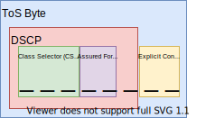
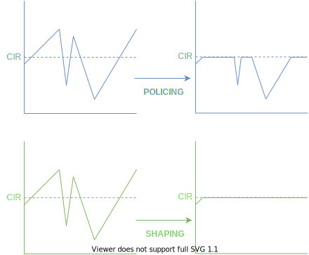

# QoS
## Why is QoS Needed?
- Lack of bandwidth
- Latency & jitter (variation in latency)
- Packet loss
## What are the 3 QoS Models?
- Best effort
- Intergrated Services (IntServ)
- Differentiated Services (DiffServ)
## Definitions
**Buffer:** Physical memory used to store packets before and after a forwarding decision is made.

**Queue:** A logical part of the shared memory buffers.

-   Without QoS = queue is one large piece of memory, First In First Out (FIFO)

-   With QoS = Can control characteristics of the queue

## Classification:

-   Traffic divided into classes

    -   A class of traffic will receive the same type of QoS treatment

-   Packets belonging to the same class typically marked on ingress to allow for easier classification by upstream devices

-   Most common ways of classifying traffic:

    -   Markings

    -   Addressing

    -   Application signatures (NBAR)

### Layer 2 Classification:

-   Ethernet frames contain no distinctive "priority" filed unless carried by 802.1Q or ISL trunks

-   Class of Service (CoS) byte

### Layer 3 Classification:

-   Both IPv4 & IPv6 packets contain a byte used for indicating relative priority of a packet

-   Type of Service (ToS) byte

### NBAR:

-   Network-Based Application Recognition (NBAR)

-   Most protocols can be identified by matching their well-known L3 or L4 numbers

    -   Some protocols negotiate dynamic numbers and can't be matched this way

    -   NBAR examines the data payload for signatures

    -   More CPU intensive than other classification features

 

## Trust Boundaries:

-   Some host devices may mark traffic upon creation

-   Do we trust these device? Usually NO

-   QoS Trust Boundaries

    -   Logical point in network beyond which, received QoS markings are not trusted

    -   Typically access-layer ports

    -   Default when QoS enabled = Untrusted

 

## DSCP:

-   DSCP = Differentiated Services Code Point

    -   First 6 bits of the ToS bytes

-   There are 4 high-level traffic classes defined for DSCP per-hop behaviours:

    -   Default Forwarding (DH) PHB

        -   000000xx (DSCP value 0)

    -   Expedited Forwarding (EF) PHB

        -   101110xx (DSCP value 46)

    -   Assured Forwarding (AF) PHB

        -   AF11 - AF43

            -   First Number corresponds to CS value and 2nd value corresponds to AF value

            -   E.g. AF31 means a CS value of 3 and an AF value of 1 (DSCP value of 011010xxx)

    -   Class Selector (CS) PHB

        -   CS1 - CS7

            -   AF bits set to 0

            -   E.g. CS3 means a CS value of 3 and an AF value of 0 (DSCP value of 011000xx)

## Congestion Avoidance:

-   Prevent queues becoming congested

-   Can be done in 3 places:

    -   Ingress interface queue

    -   At the forwarding engine (policing)

    -   The egress queue (queueing and shaping)

## Committed Information Rate (CIR) - Policing and Shaping:

-   Between ISP and customer there is an agreed CIR (e.g. 50 Mbps)

    -   ISP will police ingress traffic

        -   Traffic that is non-conforming is caught by a policer and:

            -   Dropped

            -   Marked down

    -   Customer typically doesn't want traffic dropped (delay is better)

        -   Customer shapes egress traffic towards ISP

## Queueing-Based Congestion Avoidance:

-   Set of features to pre-emptively drop traffic within queues

-   On switches:

    -   Weighted Tail Drop (WTD)

    -   Weighted Random Early Discard (WRED)

    -   Dynamic Buffer Limiting (DBL)

-   On Routers:

    -   WRED

##  WRED & WTD Terminology:

-   Drop Thresholds

    -   Minimum = When drops begin

    -   Maximum = Point at which 100% of matched traffic is dropped

## WRED:

-   Random packet drops start at the min-threshold

-   Increase in linear format until max-threshold is reached

-   After max-threshold reached, WRED drops 100% of all subsequent packets received

## Queueing & Scheduling:

-   **Scheduling**: How is the queue serviced?

-   Queueing Features:

    -   First In First Out (FIFO) - default

    -   Weighted Fair Queueing (WFQ)

    -   Low-Latency Queueing (LLQ)

    -   Class-Based Weighted Fair Queueing (CBWFQ)

-   Scheduling Features:

    -   Round Robin

    -   Weighted Round Robin

    -   LLQ

    -   CBWFQ
